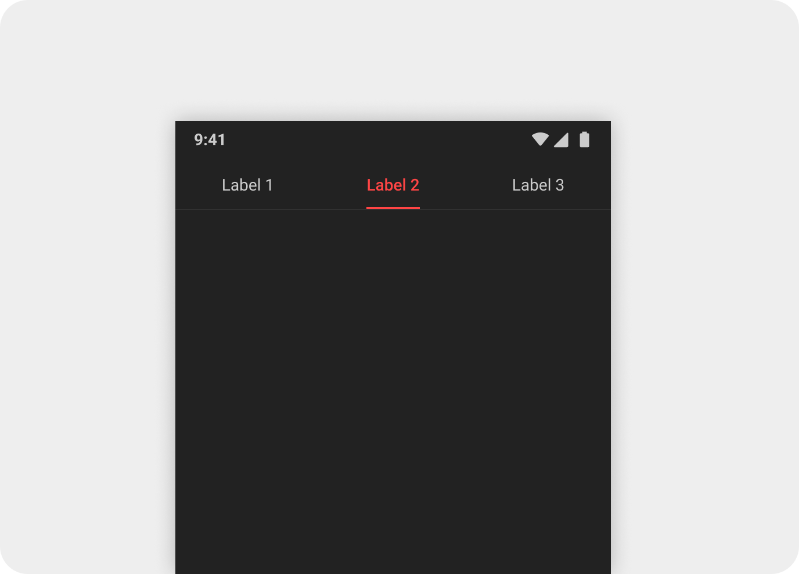
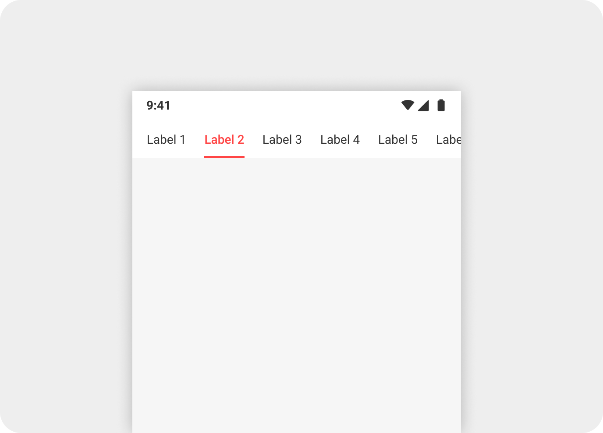
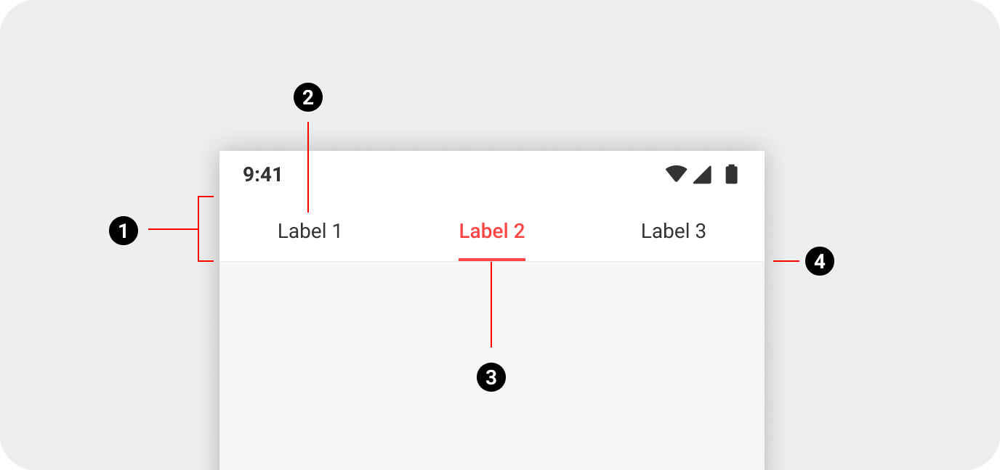
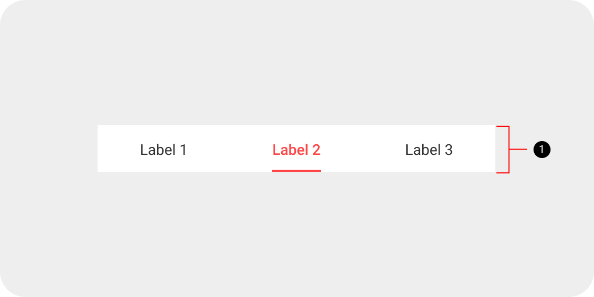
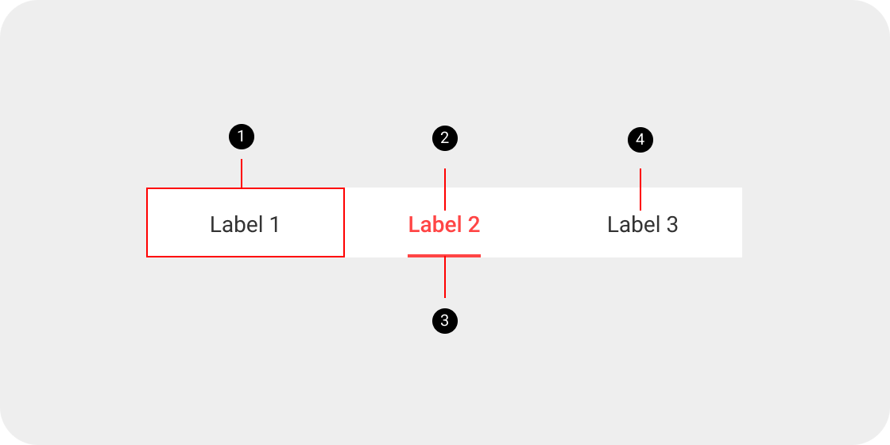
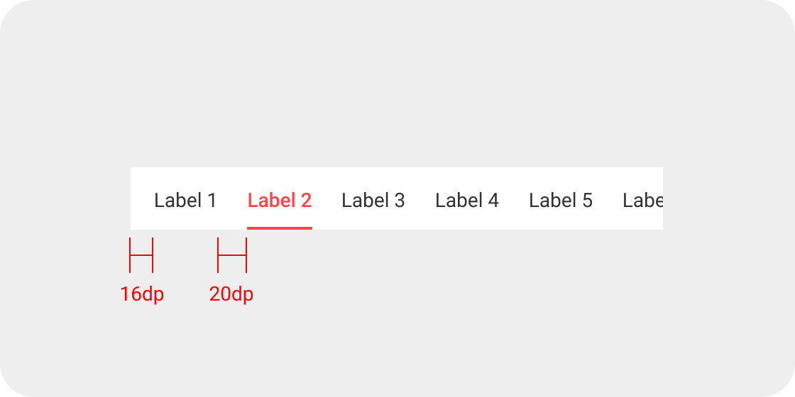
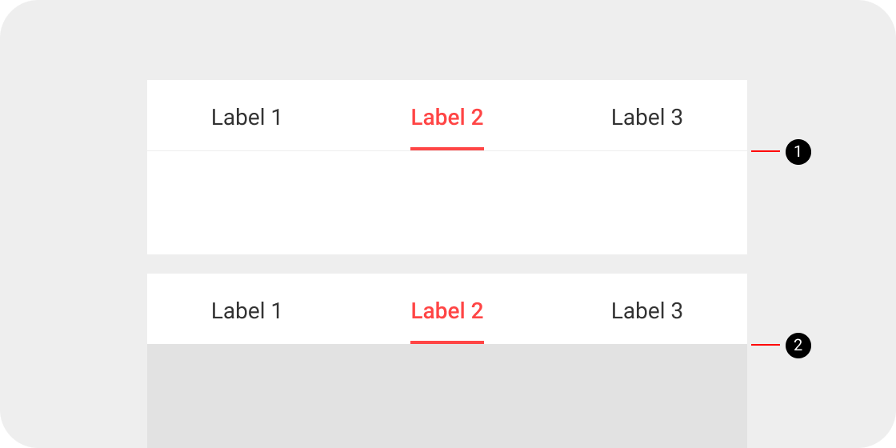
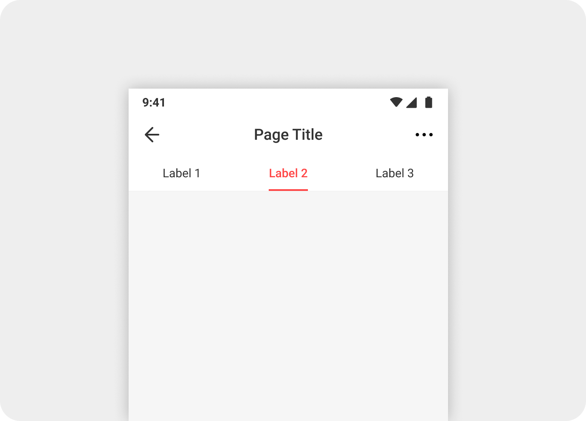
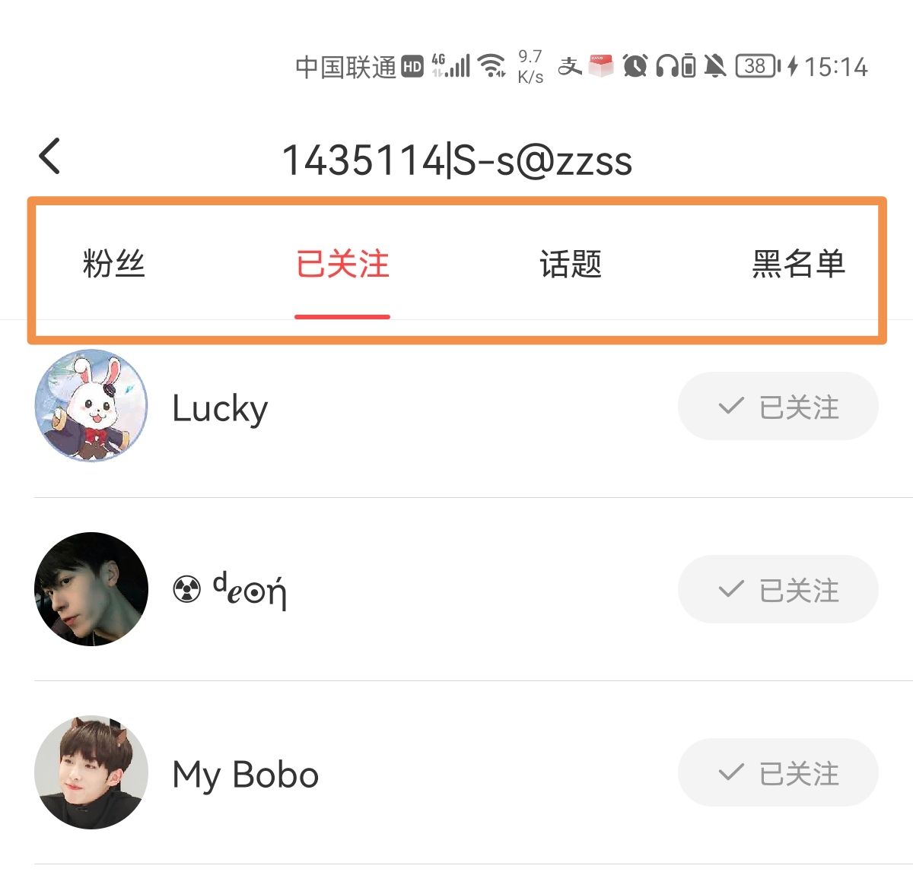

followPageAdapter = new UserFollowPageAdapter(this.getSupportFragmentManager(), userId, this);
viewPager.setAdapter(followPageAdapter);
tabLayout.setupWithViewPager(viewPager);

## 1导航栏

<b>`ThemeTabLayout`</b>导航栏组件简介:
封装了TabLayout,统一了Tablayout使用风格和避免自定义Tab等.

<div align="center">


</div>

> 支持带角标的Tab
> 支持镜像语言

## 2UI设计

### 2.1应用场景

Tab栏用于容纳一个以上标签页，标签页之间一般属于并列关系

+ 固定列数

  > 最多支持四列
  >
  > <div align="left">
  > 
  > </div>

+ 滚动

  > 当列数超过四列，或少于四列但文字很长时，使用滚动Tab栏
  >
  > <div align="left">
  > 
  > </div>
### 2.2组成

导航栏由容器、选项、指示符、选项遮罩、右侧图标按钮、分割线组成

<div align="left">

</div>

- ① ThemeConstraintLayout 容器
- ② TabTextView 选项 
- ③ TabIndicator 指示符
- ④ 底部分割线(暂无)

### 2.3标注

+ 容器
> 高度44dp(不包含分割线)
> <div align="left">
> 
> </div>
+ 选项
> 1.在固定列数时，每一列的宽度=屏幕宽度/列数
> 2.选中文字：字体Roboto Medium，字号14，颜色主题色
> 3.指示符：宽度=文字+红点布局宽度，高度2dp，颜色主题色，和容器靠下对齐
> 4.未选中文字：字体Roboto Regular，字号14，颜色Primary Text
>
> <div align="left">
> 
> </div>
+ 滚动Tab栏
> 选项列表左间距16dp，最后一项右间距16dp，选项之间距离20dp
>
> <div align="left">
> 
> </div>
+ 红点
> <div align="left">
> 
> </div>
+ 分割线
> 1.当Tab栏和页面背景颜色相同，为了区分（也是为了配合GP推荐的要求），需要分割线
> 分割线1px，颜色为Divider
> 2.当Tab栏和页面背景不同，不需要分割线
>
> <div align="left">
> 
> </div>
### 2.4交互

+ 左右滑动页面的空白部分，切换标签页

+ 在某些场景下，Tab栏可以吸顶，但一般固定在标题栏下面(暂无吸顶)

  > <div align="left">
  > 
  > </div>

## 2使用

### 2.1开发理念

该控件主要解决以下问题:

> Tab的customView自定义风格不一致的问题
>
> tab的选择/未选中状态自行定义字体色值、大小等的问题
>
> 角标状态与Tab状态脱离的问题
>
> 代码中差异化处理镜像布局的问题
>
> 保证能够面向vp和vp2具有表现一致性.

开发者在使用过程中,不必再去关心customView、镜像等问题,只需关注业务内容即可.

### 2.2摘要

#### 2.2.1属性

| 属性              | 类型   | 作用                     |
| ----------------- | ------ | ------------------------ |
| themeTabStyle     | enum   | 导航栏风格               |
| dotViewType       | enum   | Tab弱提醒风格(红点/数字) |
| tabIndicatorColor | String | 指示器颜色               |

+ 导航栏风格

|        themeTabStyle         |  类型   | 特征                                                         |
| :--------------------------: | :-----: | :----------------------------------------------------------- |
|            title             | boolean | 可滚动,tab指示器为宽度20dp且高度3dp半径1.5dp的圆角矩形(主题色); 未选中时字体16;选中时,字体大小18,颜色#CCCCCC(#333333) |
| fixedSubtitle/scrollSubtitle | String  | 不可滚动/可滚动,,tab指示器为宽度与tab文本宽度一致且高度2dp半径4dp的圆角矩形(主题色); 未选中时字体14;选中时,字体大小14,颜色#CCCCCC(#333333) |

#### 2.2.2api

##### 自定义tab内部view(customView)

ThemeTabLayout内部实现了自定义的风格统一的Tab,因此无需再调用TabLayout的setCustomView()方法来实现自定义tab内部view.

customView是一个宽度为LayoutParams.WRAP_CONTENT,高度为30dp的[TabTextView](链接).

该customView支持的功能有:

> 支持不同导航栏主题下的不同的颜色和字体大小设置
>
> 支持角标设置.

##### addOnTabSelectedListener

  控件内部调用了addOnTabSelectedListener方法,实现了选中和未选中状态时不同导航栏风格的Tab属性设置,无特殊情况,开发者无需再对Tab进行属性修改.

  开发者依旧可以调用addOnTabSelectedListener来做事件埋点等其他工作.

```java
mTabLayout.addOnTabSelectedListener(new TabLayout.OnTabSelectedListener() {
  @Override
  public void onTabSelected(TabLayout.Tab tab) {
    logPageEnter(); // 事件埋点
  }

  @Override
  public void onTabUnselected(TabLayout.Tab tab) {

  }

  @Override
  public void onTabReselected(TabLayout.Tab tab) {

  }
});
```

##### updateDotView  更新角标状态

调用updateDotView方法用来更新弱提醒状态(红点或数字)

```
FavoriteDbModel.getUpdatedCount(getContext()).doOnSuccess(updatedCount -> {
      // 书柜页-收藏更新小红点状态
      mTabLayout.updateDotView(mTabLayout.getTabAt(1), updatedCount > 0);
    }).subscribe();
```

### 代码示例

+ 导航栏-用户关注

  用户关注页使用了固定列数的副标题类型,只需在xml中设置属性themeTabStyle为fixedSubtitle即可,无特殊要求,不需要在java代码里设置addOnTabSelectedListener方法.
  
```java
followPageAdapter = new UserFollowPageAdapter(this.getSupportFragmentManager(), userId, this);
viewPager.setAdapter(followPageAdapter);
tabLayout.setupWithViewPager(viewPager);
```

 ``` xml
   <mobi.mangatoon.widget.tablayout.ThemeTabLayout
     android:id="@+id/tabLayout"
     android:layout_width="match_parent"
     android:layout_height="wrap_content"
     app:tabIndicatorColor="@color/mt_primary"
     app:themeTabStyle="fixedSubtitle" />
 
 
 ```
<div align="center">

</div>

