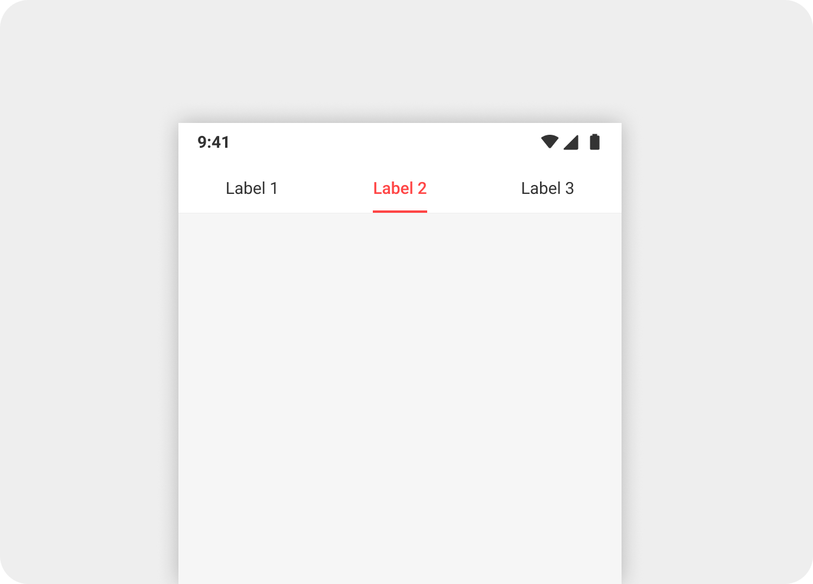
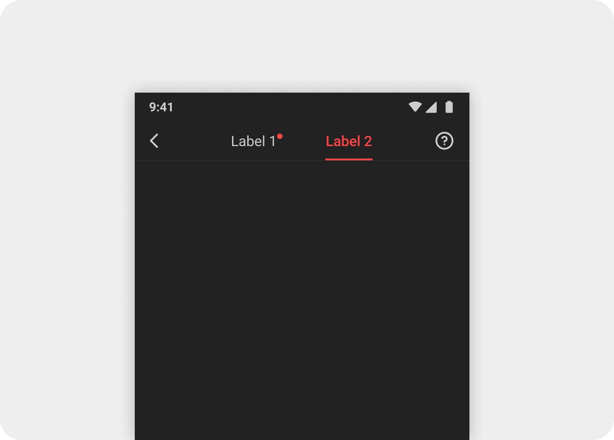
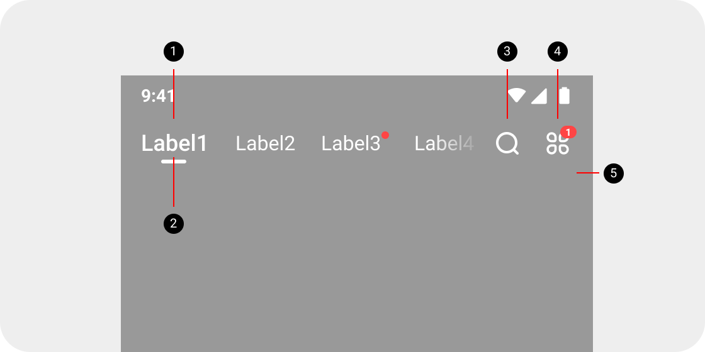

# ThemeTabLayoutWrapper

>[导航栏](#导航栏)
>
>[UI设计](#UI设计)  
>​		[应用场景](#UI设计##应用场景)  
>​		[组成](#UI设计##组成)  
>​		[主题](#UI设计##主题)  
>​		[标注](#UI设计##标注)  
>​ 		[交互](#UI设计##交互)
>
>[使用](#使用)  
>​         [开发理念](#使用##开发理念)  
>​		[摘要](#使用##摘要)  
>​		[代码示例](#使用##代码示例)

# 导航栏

<b>`ThemeTablayoutWrapper`</b>导航栏组件简介:

​	进一步对[ThemeTablayout](https://gitlab.mangatoon.mobi/android/mangatoon-android-docs/blob/master/%E5%9F%BA%E7%A1%80%E6%8E%A7%E4%BB%B6%E6%96%87%E6%A1%A3/%E5%AF%BC%E8%88%AA%E6%A0%8F-ThemeTabLayout.md)进行封装,增加了左侧单图标、右侧单/双图标支持、底部分割线等,,并进行了局部模糊处理.该控件用作最顶级导航栏.

<div align="center">



</div>

<br>


# UI设计

## 应用场景

​	导航栏用于一级页面的顶部，容纳多个标签页的导航，标签页之间没有并列关系，也可以容纳图标按钮。目前用于MT小说页、MT发现页、NT发现页、AT发现页。导航栏固定在顶部，不会被滑出屏幕。

​	导航栏也用于两个tab和左右操作按钮并存的情况.

## 组成

导航栏由容器、选项、指示符、选项遮罩、右侧图标按钮(可选)、分割线组成,当右侧没有按钮图标时,不会显示选项遮罩.


<div align="center">


</div>

- ① ThemeConstraintLayout 
- ② TabTextView 选项 (ThemeTabLayout)
- ③ TabIndicator  (ThemeTabLayout)
- ④ 选项遮罩
- ⑤ TabTextView 图标按钮1
- ⑥ TabTextView 图标按钮2
- ⑦ 底部分割线

## 主题

+ 默认主题

> 标题栏内容颜色跟随app颜色模式变化
>
> <div align="center">
> 
> 
> </div>

+ 透明背景主题:

> 当背景是深色图片或深色时，导航栏使用透明背景,文案、指示符、图标按钮使用白色
> <div align="left">

</div>

## 标注

+ 容器
> 高度44dp(不包含分割线)
> <div align="center">
> 
> 
> </div>
+ 选项文字
> 1.选中选项文字：字体Roboto Medium，字号18，颜色Primary Text
> 2.未选中选项文字：字体Roboto Regular，字号16，颜色Primary Text
> 3.文字始终相对容器垂直居中
>
> <div align="left">
> 
> </div>
+ 指示符
> 1.指示符20x3dp，圆角2dp，距离文字2dp，颜色主题色
> <div align="left">
> 
> </div>
+ 过渡遮罩
> 1.遮罩跟随右侧图标按钮出现，距离图标按钮8dp,遮罩宽度40dp，选项列表透明度从左到右，透明度从0变为100
> <div align="left">
> 
> </div>
+ 图标按钮
> 可以用图标表达清楚意思的通用性强的操作，可以使用iconfont图标,iconfont字号24
>
> 右侧最多容纳两个,左侧最多一个
>
> <div align="center">
> 
> 
> </div>
+ 角标(数字)
> 红点和文字的对齐关系
> <div align="left">
> 
> </div>
+ 角标(红点)
> 红点和图标的对齐关系
> <div align="left">
> 
> </div>
+ 分割线
> 1.当导航栏和页面背景颜色相同，为了区分（也是为了配合GP推荐的要求),需要分割线,分割线1px，颜色为Divider
> 2.当导航栏和页面背景不同，不需要分割线
> <div align="center">
> 
> 
> </div>
+ 透明背景，白色文字
> 1.文字颜色用Primary Light Text
> 2.指示符用Primary Light Text
> 3.4 图标用Primary Light Text
> 5.不需要分割线
>
> <div align="left">
> 
> </div>

## 交互

+ 选项列表支持滑动
> 1.当选项列表展示不全时，可以左右滑动
> 2.当选项列表可以完全展示时，不需要滑动
+ 透明背景的场景下，向上滑动后，过渡为正常的背景(功能待定)
+ 左右滑动页面的空白部分，切换标签页

# 使用

## 开发理念

对ThemeTabLayout进行封装,增加UI装饰.

如果UI对底部分割线或图标有需求的话,可以使用该控件,否则建议使用[ThemeTabLayout](链接)

1. 如无特殊要求layout_width 使用<b>`match_parent`</b>, layout_height使用<b>`wrap_content`</b>
2. 根据需求来设置[属性](#### 属性)

## 摘要

### 属性

| 属性           | 类型    | 作用                                   |
| -------------- | ------- | -------------------------------------- |
| tabLayoutStyle | enum    | 导航栏风格                             |
| withUnderLine  | boolean | 是否显示底部分割线                     |
| tabIconType    | enum    | ThemeTabLayout的Tab角标类型(红点/数字) |
| iconType1      | enum    | icon1角标类型(红点/数字)               |
| iconType2      | enum    | icon2 角标类型(红点/数字)              |

### api

#### initIcon

初始化指定位置的icon内容及设置点击事件

```java
tabLayoutWrapper?.apply {
  initIcon(
    ThemeTabLayoutWrapper.IconPosition.ICON_POSITION_1,
    getString(R.string.icon_write),
    null)
  initIcon(
    ThemeTabLayoutWrapper.IconPosition.ICON_POSITION_2,
    getString(R.string.icon_channel),
    null)
}
```

#### getIconView

获取指定位置的icon

```java
val msgController = NewFunctionMsgController(
  NewFunctionMsgController.channel,
  getIconView(ThemeTabLayoutWrapper.IconPosition.ICON_POSITION_2),
  null)
```

#### getThemeTabLayout

获取ThemeTabLayout,以对Tablayout进行操作

#### getCustomView

获取指定tab的customView,可以进行更新角标状态等

```java
private fun createTabMediator(): TabLayoutMediator? {
  val tabLayout = tabLayout ?: return null
  val viewPager = viewPager ?: return null
  return TabLayoutMediator(tabLayout, viewPager) { tab, position ->
    adapter?.let {
      tabLayoutWrapper?.getCustomView(tab)?.updateDotView(it.isDotVisible(position))
      tab.text = it.getPageTitle(position)
      logTabShowEvent(position)
    }
  }
}
```

## 代码示例

+ 导航栏-发现页

  发现页导航栏使用了可以兼有底部分割线和两个图标按钮的可滑动的主标题类型,在xml中分别要对属性tabLayoutStyle,

  iconType1,iconType2,withUnderLine,tabIconType进行设置.

 ``` xml
  <mobi.mangatoon.widget.tablayout.ThemeTabLayoutWrapper
    android:id="@+id/tabLayoutWrapper"
    android:layout_width="match_parent"
    android:layout_height="wrap_content"
    app:tabLayoutStyle="title"
    app:iconType1="onlyIconText"
    app:iconType1="with_num"
    app:withUnderLine="true"
    app:tabIconType="with_dot"
    app:layout_constraintTop_toTopOf="parent"
    app:layout_constraintEnd_toEndOf="parent"
    app:layout_constraintStart_toStartOf="parent" />
 ```

<div align="center">

</div>

+ 导航栏-书柜

  书柜页使用了兼有底部分割线和Tab带有角标(红点)的固定副标题类型,在xml中需要对tabLayoutStyle,withUnderLine,tabIconType属性设值.

```xml
<mobi.mangatoon.widget.tablayout.ThemeTabLayoutWrapper
  android:id="@+id/tabLayout"
  android:layout_width="match_parent"
  android:layout_height="wrap_content"
  app:tabLayoutStyle="fixedSubtitle"
  app:withUnderLine="true"
  app:tabIconType="with_dot" />
```

<div align="center">

</div>
