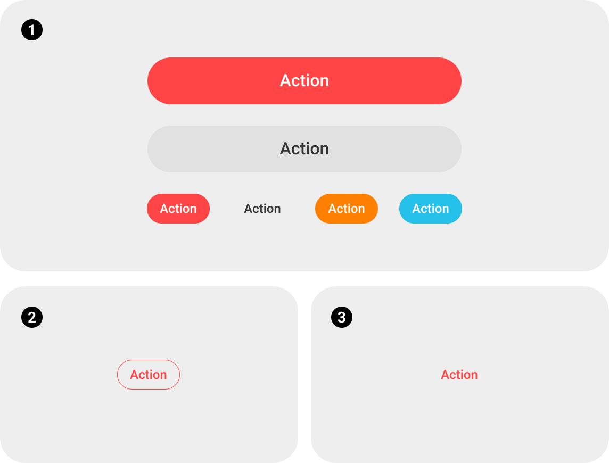
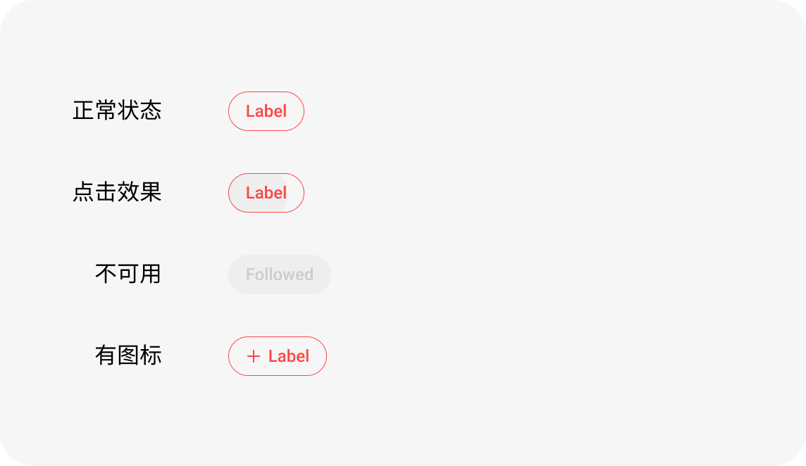

# MTCompatButton

>[按钮](#按钮)
>
>[UI设计](#UI设计)  
>​		[应用场景](#UI设计##应用场景)  
>​		[组成](#UI设计##组成)  
>​		[主题](#UI设计##主题)  
>​		[标注](#UI设计##标注)  
>​ 		[交互](#UI设计##交互)
>
>[使用](#使用)  
>​         [开发理念](#使用##开发理念)  
>​		[摘要](#使用##摘要)  
>​		[代码示例](#使用##代码示例)

# 按钮

按钮根据样式分为三种类型:

<div align="left">

</div>

+ ①填充按钮

  > 用于强调操作,作为页面中的主要(重度)操作,或希望用户操作的功能

+ ②描边按钮

  > 用于相对中等的操作

+ ③文字按钮

  > 用于相对不强调的操作


按钮根据功能分为四种类型:

+ [大主要按钮](#UI设计##标注###大主要按钮)(填充)


+ [ 大次要按钮](#UI设计##标注###大次要按钮)(填充)


+ [ 小主要按钮](#UI设计##标注###小主要按钮)(填充)


+ [ 描边按钮](#UI设计##标注###描边按钮)

# UI设计

## 应用场景

应用场景主要包含[对话框](###对话框)、[标题栏](###标题栏)、[对话框](###对话框)、[列表/卡片](###列表/卡片)、[页面中间](###页面中间)、[页面底部](###页面底部)

### `对话框`

> 1. 主要(重度)操作、次要操作使用填充按钮
> 2. 不强调的操作使用文字按钮
>
> <div align="left">
> 
> </div>

### `标题栏`

> 1. 主要操作、次要操作使用填充按钮
> 2. 相对不重要，但需要引导的，用高亮文字按钮
> 3. 不重要的，用深灰色文字按钮
>
> <div align="left">
> 
> </div>

### `列表/卡片`

> 1. 主要操作使用填充按钮
> 2. 在同一个页面里，需要做按钮主次区分的情况下，次要按钮使用描边按钮
>
> <div align="left">
> 
> </div>

### `页面中间`

用于页面内容中的按钮区
> 1. 主要操作使用填充按钮
> 2. 在同一个页面里，需要做按钮主次区分的情况下，次要按钮使用描边按钮
> 3. 不调强的按钮使用文字按钮
>
> <div align="left">
> 
> </div>

### `页面底部`

位于页面底部的操作栏

> 1. 使用填充按钮
>
> <div align="left">
> 
> </div>

## 组成

## 点击效果

> 1. ①和②填充按钮: 水波纹,颜色24%white
>
> 2. ③描边按钮:水波纹,颜色24%gray99
>
> 3. ④文字按钮:水波纹,颜色24%gray99
>
>    <div align="left">
>    
>    </div>

## 标注

### 大主要按钮

> | 高度 | 宽度                 | 圆角 | 背景色               | 文字颜色                                | 字体          | 字号                    | 文字限制                       | 点击效果            | 不可用状态                                    |
> | ---- | -------------------- | ---- | -------------------- | --------------------------------------- | ------------- | ----------------------- | ------------------------------ | ------------------- | --------------------------------------------- |
> | 44dp | 通过固定间距计算宽度 | 最大 | btn_primary_bg_color | text_primary_inverse_color</br> #FFFFFF | Roboto Medium | 场景1: 16</br>场景2: 14 | 距离按钮左右间隔20dp，过长省略 | 水波纹overlay_light | 背景变色#80主题色btn_disable_primary_bg_color |
> <div align="left">
> 
> </div>

### 大次要按钮

> | 高度 | 宽度                 | 圆角 | 背景色                              | 文字颜色                | 字体          | 字号 | 文字限制                       | 点击效果            | 不可用状态                            |
> | ---- | -------------------- | ---- | ----------------------------------- | ----------------------- | ------------- | ---- | ------------------------------ | ------------------- | ------------------------------------- |
> | 44dp | 通过固定间距计算宽度 | 最大 | btn_secondary_bg_color</br> #EEEEEE | text_primary_color</br> | Roboto Medium | 16   | 距离按钮左右间隔20dp，过长省略 | 水波纹overlay_light | 文字变色#CCCCCC<br>color_text_disable |
> <div align="left">
> 
> </div>

### 小主要按钮

> | 高度 | 宽度                                                         | 圆角 | 背景色             | 文字颜色                                | 字体          | 字号 | 文字限制                   | 点击效果            | 不可用状态                                    | 已关注状态 | 固定深恶背景下的已关注状态 |
> | ---- | ------------------------------------------------------------ | ---- | ------------------ | --------------------------------------- | ------------- | ---- | -------------------------- | ------------------- | --------------------------------------------- | ---------- | -------------------------- |
> | 28dp | 场景1:固定宽度</br>场景2:适应内容的宽度(在哥哥场景下规定最大/小宽度) | 最大 | 主题色、橙色、蓝色 | text_primary_inverse_color</br> #FFFFFF | Roboto Medium | 12   | 场景2:文字距离左右间隔12dp | 水波纹overlay_light | 背景变色#80主题色btn_disable_primary_bg_color |            |                            |
>
> <div align="left">
> 
> </div>


### 描边按钮

> | 高度 | 宽度                                                         | 圆角 | 背景色                     | 文字颜色   | 字体          | 字号 | 文字限制                   | 点击效果           | 不可用状态                                           |
> | ---- | ------------------------------------------------------------ | ---- | -------------------------- | ---------- | ------------- | ---- | -------------------------- | ------------------ | ---------------------------------------------------- |
> | 28dp | 场景1:固定宽度</br>场景2:适应内容的宽度(在哥哥场景下规定最大/小宽度) | 最大 | 无背景色,增加描边色:主题色 | mt_primary | Roboto Medium | 12   | 场景2:文字距离左右间隔12dp | 水波纹overlay_gray | 描边变色:mt_primary_50p</br>文字变色: mt_primary_50p |
> <div align="left">
> 
> </div>

<br>

# 使用

## 开发理念

根据应用于不同场景button的UI,规范了5种style,每种style对布局、文字、背景进行标准化.

开发过程中,只需设置style即可获取所需的button类型.layout_width可按需求场景进行设置.

## 摘要

### 属性

| style                           | 类型               |
| ------------------------------- | ------------------ |
| MangatoonBtnBig.Primary         | [大主要按钮](#UI设计##标注###大主要按钮)      |
| MangatoonBtnBig.Secondary     | [大次要按钮](#UI设计##标注###大次要按钮) |
| MangatoonBtnSmall.Primary       | [小主要按钮](#UI设计##标注###小主要按钮)(主题色) |
| MangatoonBtnSmall.PrimaryOrange | [小主要按钮](#UI设计##标注###小主要按钮)(橙色) |
| MangatoonBtnSmall.PrimaryBlue   | [小主要按钮](#UI设计##标注###小主要按钮)(蓝色) |
| MangatoonBtnSmall.Stroke        | [描边按钮](#UI设计##标注###描边按钮)     |

### api

## 代码示例

```java
<mobi.mangatoon.widget.textview.MTCompatButton
  android:id="@+id/btn1"
  style="@style/MangatoonBtnBig.Primary"
  android:text="主要按钮大"
  app:isSupportRipple="true"
  android:layout_width="150dp"
  android:layout_height="wrap_content" />
```

