## 1标题栏

<b>`NavBarWrapper`</b>继承了ThemeConstraintLayout,对控件对标题栏进行布局和风格标准化,并支持带有角标提醒的图标

=== "浅色模式"

<div align="left">
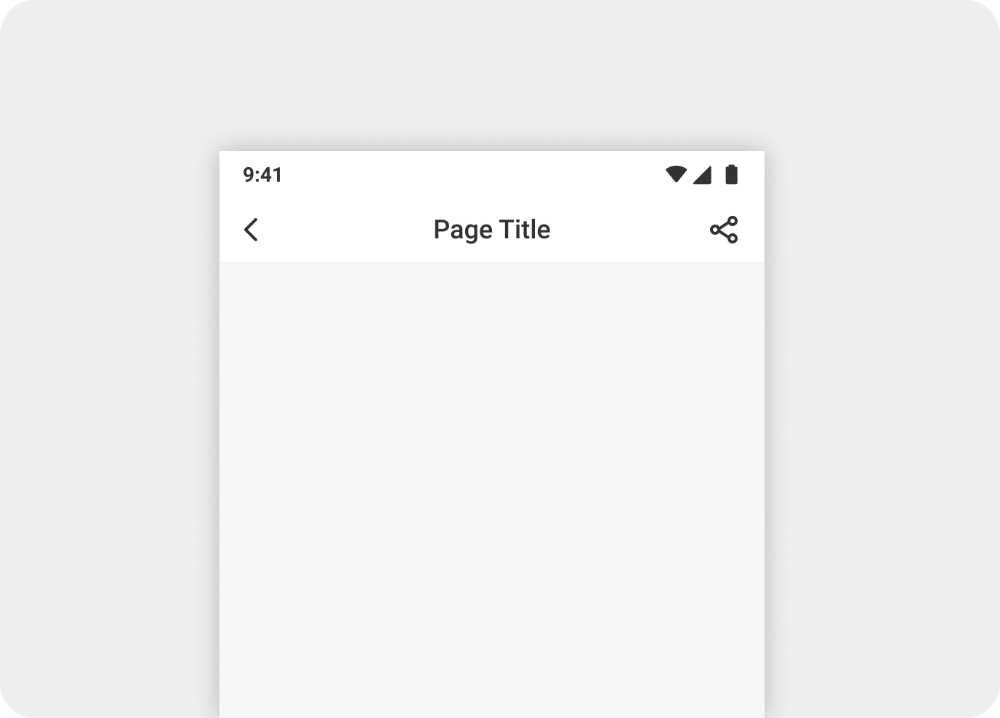
</div>

=== "深色模式"

<div align="left">
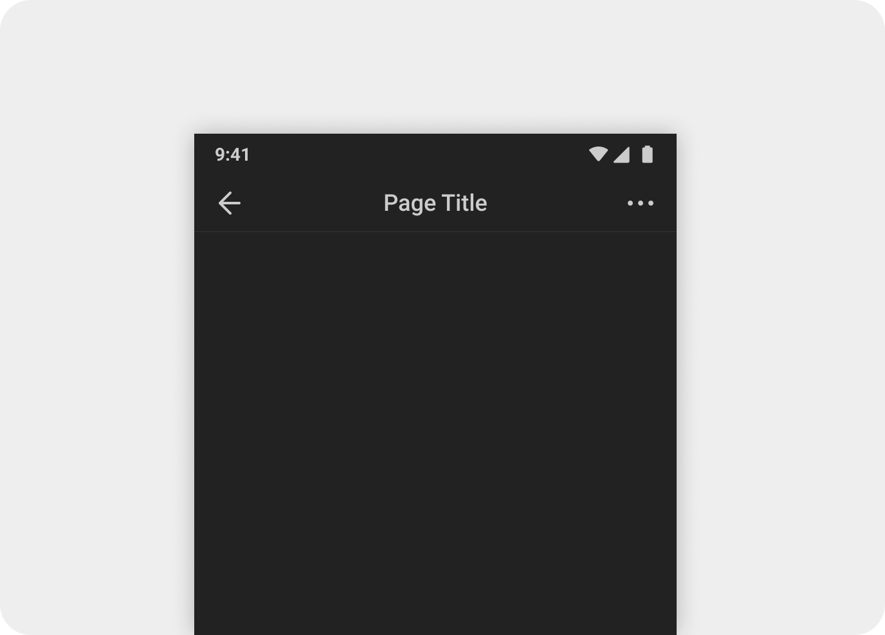
</div>

=== "透明背景主题"

<div align="center">
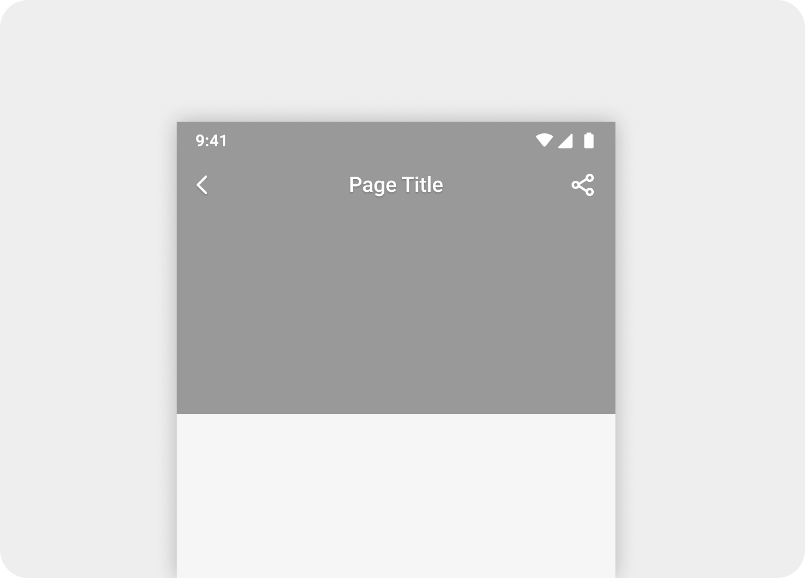
</div>

> 
>
> [UI规范](##2. UI规范)
> 	[应用场景](###2.1应用场景)
> [组成](###2.2 组成)
> 	[主题](###2.3 主题)
> 	[UI设计](### 2.4 UI设计)
> [使用说明](## 3. 使用说明)
> 	[开发理念](### 3.1 开发理念)
> 	[摘要](### 3.2 摘要)
> 		[属性](#### 3.2.1 属性)
> 		[api](#### 3.2.2 api)
> 	[示例](### 3.3 示例)

## 2UI设计

### 2.1 应用场景

标题栏用于页面的导航、展示页面标题、操作

### 2.2 组成

标题栏由容器、左侧导航、标题、右侧操作、分割线组成

<div align="center">
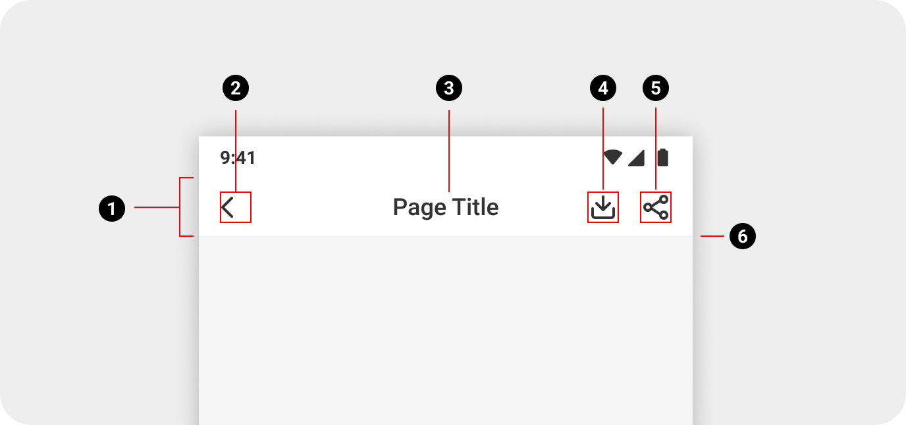
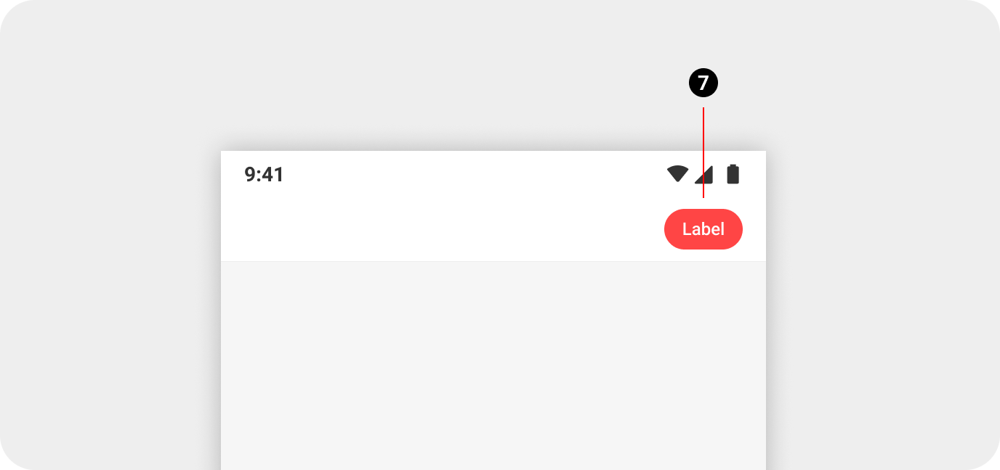
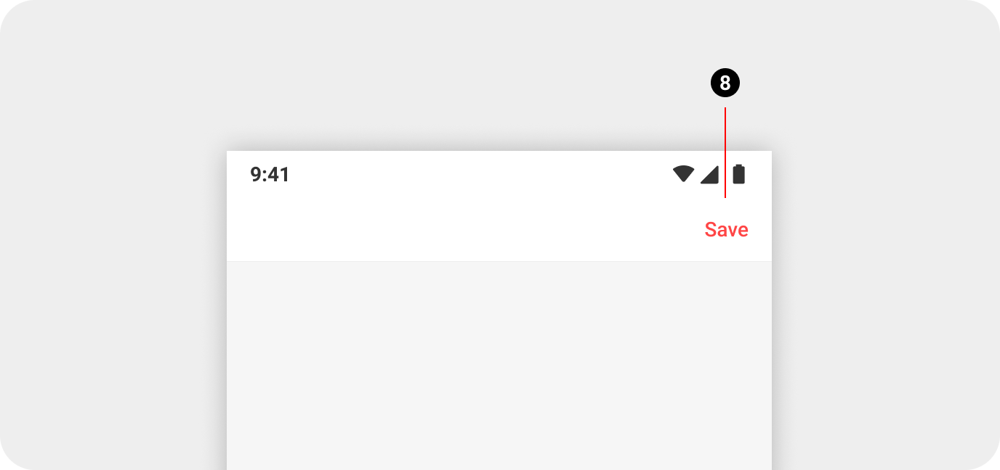
</div>

- ① ThemeConstraintLayout 容器
- ② RippleThemeTextView 导航按钮: 返回 (`withBack`)
- ③ RippleThemeTextView 主标题 (`withTitle`)
- ④ NavTextView icon1 图标按钮1 (`withIcon1`), 支持角标提醒
- ⑤ NavTextView icon2  图标按钮2 (`withIcon2`), 支持角标提醒
- ⑥ ThemeLineView 底部分割线 (`withNavLine`)
- ⑦ ThemeTextView 胶囊按钮 (`withAction`) 
- ⑧ RippleThemeTextView 副标题(文字按钮) (`withSubTitle`)

右侧操作栏顺序(从左到右): 文字按钮 - 图标按钮1 - 图标按钮2 - 按钮

<div align="center">
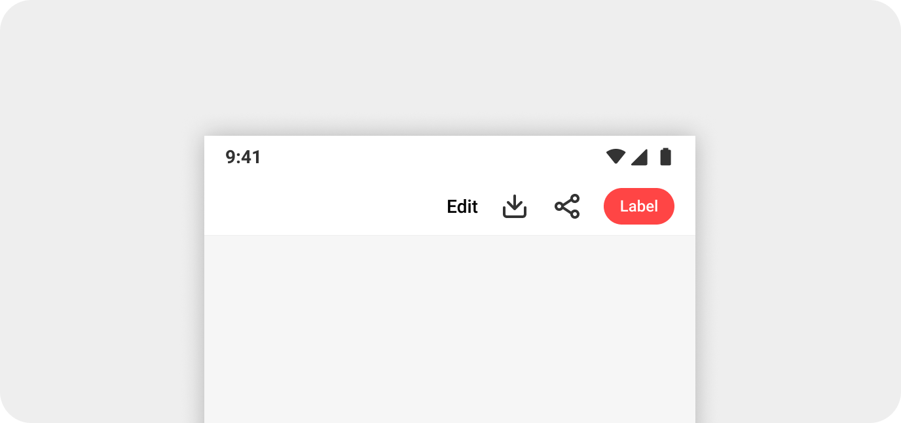
</div>

### 2.3主题

标题栏有三种主题:

+ 默认主题

  > 标题栏内容颜色跟随app颜色模式变化

+ 透明背景浅色主题

  > 当背景是深色图片或深色时，标题栏使用透明背景, 文案、图标按钮使用白色

+ 透明背景深色主题

  > 当背景是深色图片或深色时，标题栏使用透明背景, 文案、图标按钮使用黑色

  <div align="center">
    
  </div>

### 2.4标注

[UI设计稿](https://www.figma.com/file/aagp881WpGyQ211QfFHR1k/MangaToon-Libraries-(New)?node-id=8208%3A53136)

<div align="center">
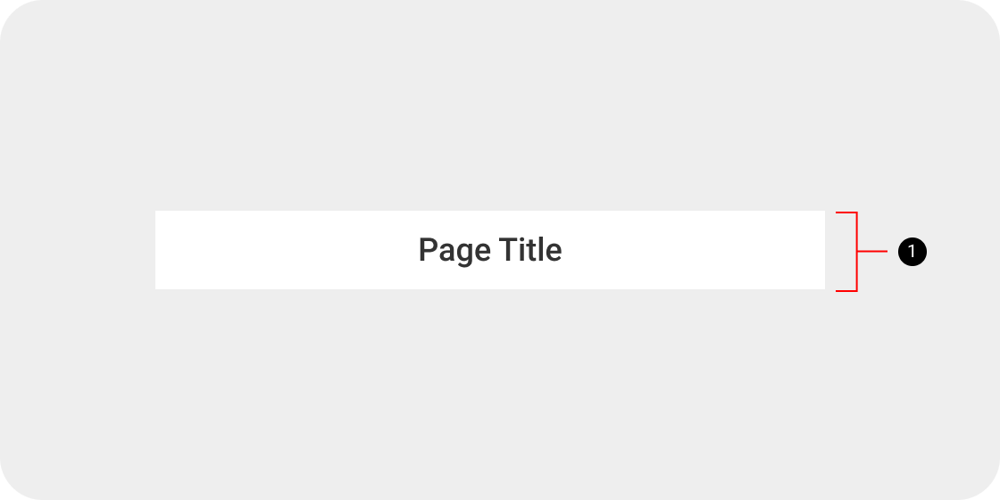
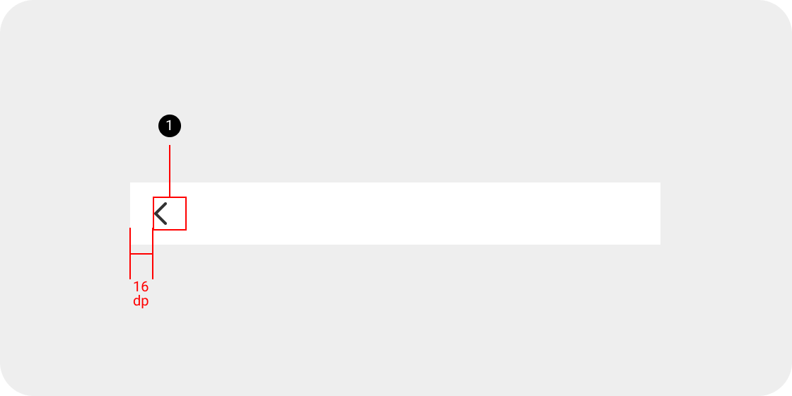
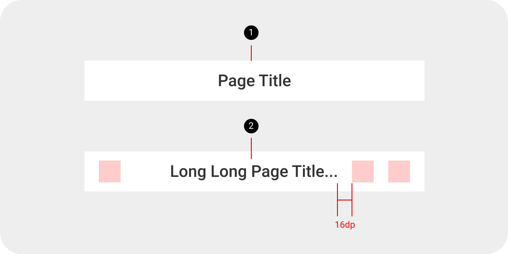
</div>

<div align="center">
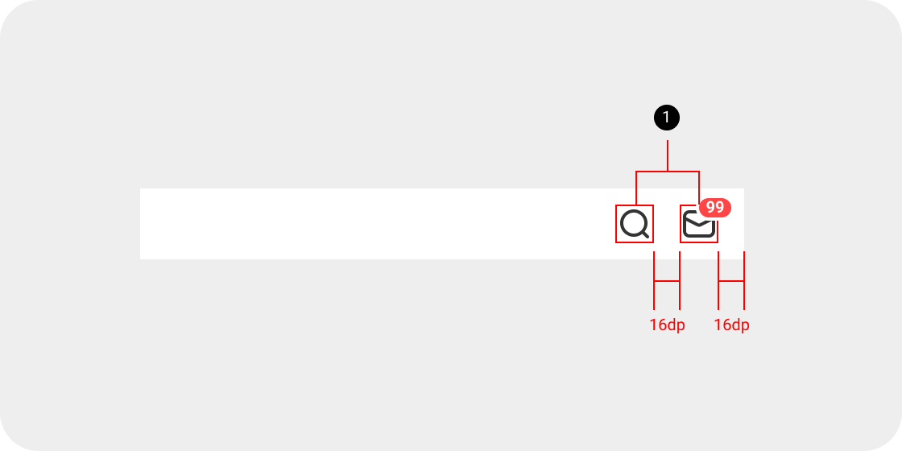
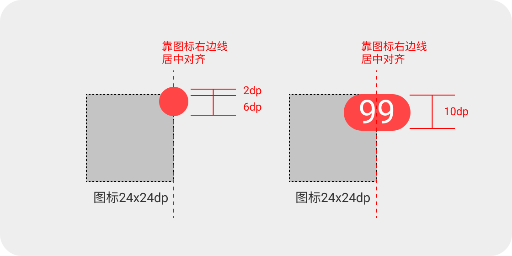
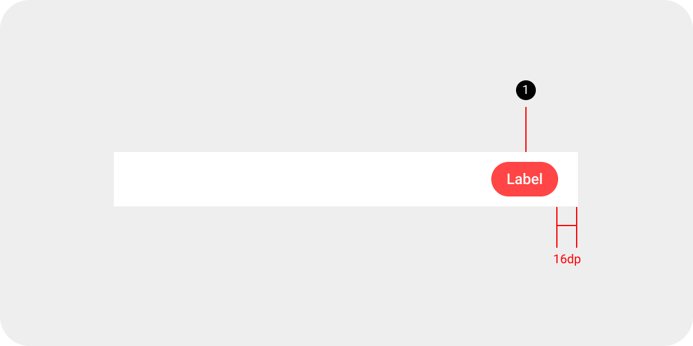
</div>

<div align="center">
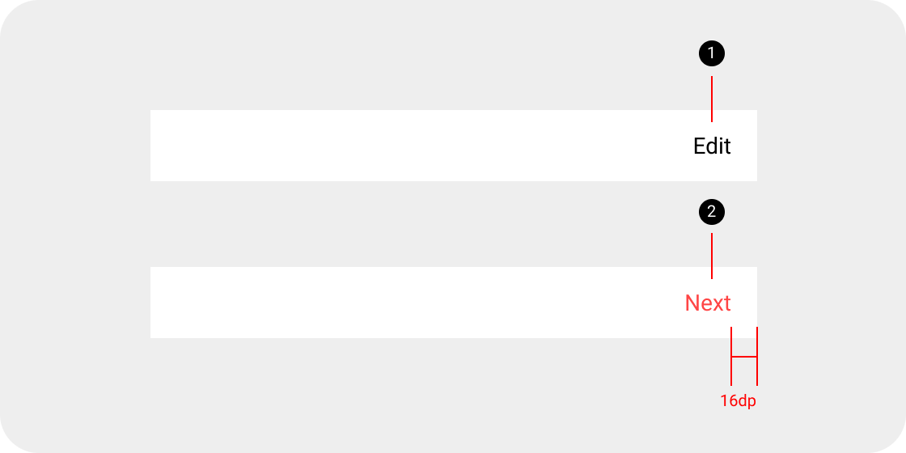
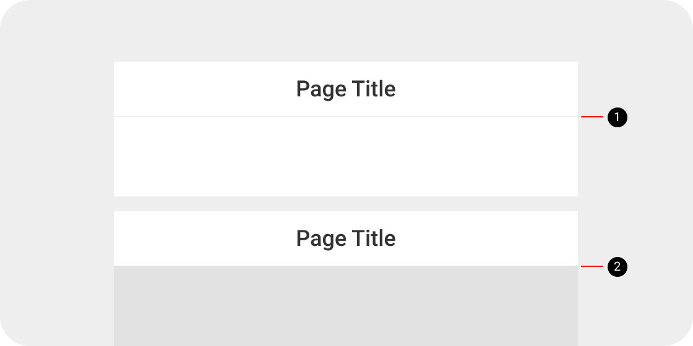
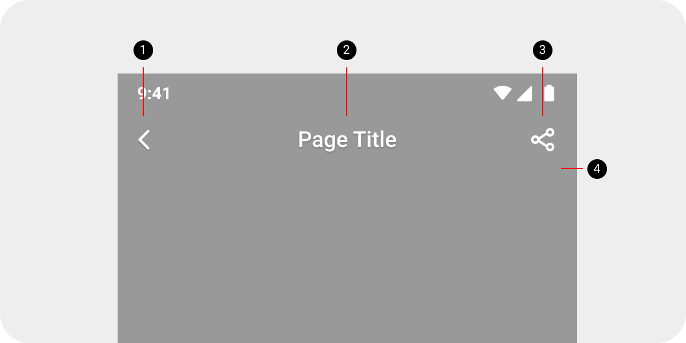
</div>


## 3使用说明

### 3.1 开发理念

该控件主要解决以下问题:

> 代码中需要索引控件并设置属性的问题
>
> 标题栏扩展性差的问题
>
> 镜像语言的问题

开发者在使用过程中,可直接在xml中直接完成文本或iconfont的设置,实现所设即所见,无需再在代码中索引控件.

在使用过程中,应注意:

> 如果直接应用在BaseFragmentActivity中, android:id应该使用<b>`baseNavBar`</b>,无需再在子Activity中再次索引该id
>
> 标题栏高度固定,如无特殊要求layout_width 使用<b>`match_parent`</b>, layout_height使用<b>`wrap_content`</b>

### 3.2摘要

#### 3.2.1属性

| 属性          | 类型    | 作用               | 默认值     |
| ------------- | ------- | ------------------ | ---------- |
| navColorStyle | enum    | 导航栏风格         | defaultNav |
| withBack      | boolean | 是否显示back按钮   | false      |
| withNavLine   | boolean | 是否显示底部分割线 | false      |
| withTitle     | string  | 设置主标题内容     |            |
| withSubTitle  | string  | 设置副标题内容     |            |
| withIcon1     | string  | 设置图标1内容      |            |
| withIcon2     | string  | 设置图标2内容      |            |
| withAction    | string  | 设置响应性行为文案 |            |

#### 3.2.2api

##### initText

```java
if (baseNavBar != null) {
  baseNavBar.initText(baseNavBar.getTitleView(), 0, navTitle);
}
```

在代码中更新指定TextView的内容,会根据不同主题设置不同内容颜色

##### forceSpecialColor

允许改变整个标题栏文本内容的颜色,不再跟随app颜色模式变化.

```java
baseNavBar.forceSpecialColor(getResources().getColor(R.color.mt_white));
```

### 3.3示例

+ 标题栏-粉丝排行榜

```xml
<mobi.mangatoon.widget.nav.NavBarWrapper
  android:id="@+id/baseNavBar"
  android:layout_width="match_parent"
  android:layout_height="match_parent"
  app:withBack="true"
  app:withTitle="@string/fans_appellation"
  app:withIcon2="@string/icon_help" />
```

<div align="center">
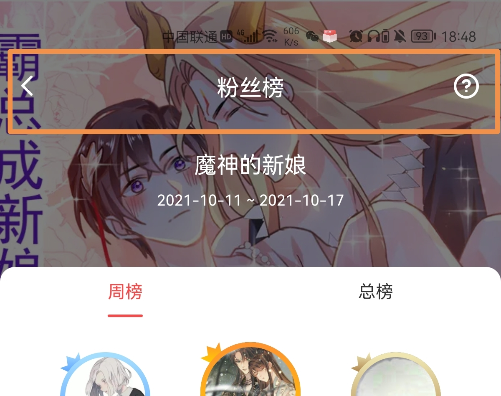
</div>

+ widget-example

```xml
<mobi.mangatoon.widget.nav.NavBarWrapper
  android:id="@+id/baseNavBar"
  android:layout_width="match_parent"
  android:layout_height="wrap_content"
  app:withBack="true"
  app:withTitle="默认"
  app:withIcon2="@string/icon_setting"
  app:withIcon1="@string/icon_search"
  app:withSubTitle="subtitle"
  app:withNavLine="true"
  app:layout_constraintTop_toTopOf="parent" />

<mobi.mangatoon.widget.nav.NavBarWrapper
  android:id="@+id/baseNavBar2"
  android:layout_width="match_parent"
  android:layout_height="wrap_content"
  app:withBack="true"
  app:withTitle="浅色"
  app:withIcon2="@string/icon_setting"
  app:withIcon1="@string/icon_msg_notice"
  app:withSubTitle="subtitle"
  app:navColorStyle="whiteNav"
  app:layout_constraintTop_toBottomOf="@+id/baseNavBar"
  android:background="@color/mt_black"
  android:layout_marginTop="10dp"
  app:withNavLine="true" />

<mobi.mangatoon.widget.nav.NavBarWrapper
  android:id="@+id/baseNavBar3"
  android:layout_width="match_parent"
  android:layout_height="wrap_content"
  app:withBack="true"
  app:withTitle="深色"
  app:withIcon2="@string/icon_setting"
  app:withIcon1="@string/icon_share"
  app:withSubTitle="subtitle"
  app:navColorStyle="darkNav"
  android:background="@color/mt_white"
  app:layout_constraintTop_toBottomOf="@+id/baseNavBar2"
  android:layout_marginTop="10dp"
  app:withNavLine="true" />
```

```java
((NavBarWrapper) findViewById(R.id.baseNavBar)).getNavIcon1().setDotViewType(DotView.TYPE_NUMBER);
((NavBarWrapper) findViewById(R.id.baseNavBar)).getNavIcon1().updateDotView(1);

((NavBarWrapper) findViewById(R.id.baseNavBar2)).getNavIcon1().setDotViewType(DotView.TYPE_NUMBER);((NavBarWrapper) findViewById(R.id.baseNavBar2)).getNavIcon1().updateDotView(110);

((NavBarWrapper) findViewById(R.id.baseNavBar3)).getNavIcon2().setDotViewType(DotView.TYPE_DOT);((NavBarWrapper) findViewById(R.id.baseNavBar3)).getNavIcon2().updateDotView(true);
```

<div align="center">
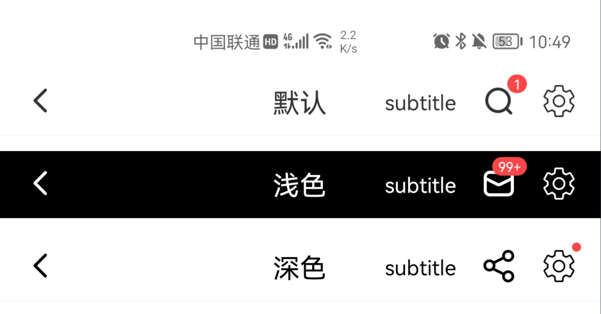
</div>
