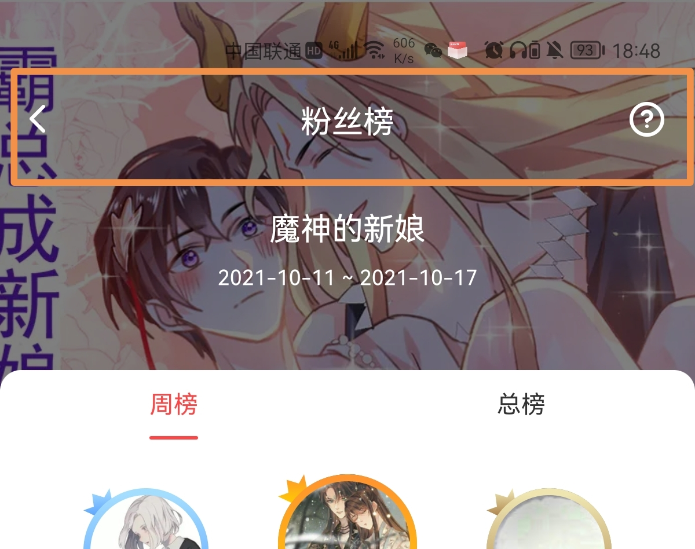
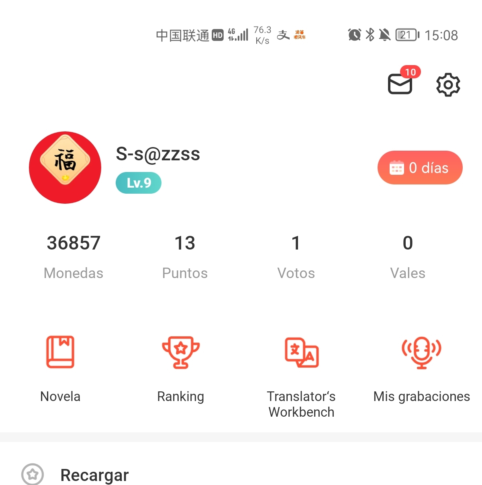

##### <font color='#999999'>


#####  通用组件</font>

# C01 标题栏


------

<b>`NavBarWrapper`</b>继承了ThemeConstraintLayout,该控件对标题栏进行布局和风格标准化,并支持带有角标提醒的图标

------


## 设计

<div align="left">

</div>


------


## 应用场景

标题栏用于页面的导航、展示页面标题、操作


------


## 组成

标题栏由容器、左侧导航、标题、右侧操作、分割线组成


<div align="left">

</div>


<div align="left">

</div>

<div align="left">

</div>


- ① ThemeConstraintLayout 容器
- ② RippleThemeTextView 导航按钮: 返回 (`withBack`)
- ③ RippleThemeTextView 主标题 (`withTitle`)
- ④ NavTextView icon1 图标按钮1 (`withIcon1`), 支持角标提醒
- ⑤ NavTextView icon2  图标按钮2 (`withIcon2`), 支持角标提醒
- ⑥ ThemeLineView 底部分割线 (`withNavLine`)
- ⑦ ThemeTextView 胶囊按钮 (`withAction`) 
- ⑧ RippleThemeTextView 副标题(文字按钮) (`withSubTitle`)


右侧操作栏顺序(从左到右): 文字按钮 - 图标按钮1 - 图标按钮2 - 按钮

<div align="left">

</div>


------


## 深色模式

标题栏内容颜色跟随app颜色模式（正常模式/深色模式）变化

<div align="left">

</div>


------


## 透明容器背景

在固定的深色背景/图片下，使用透明容器背景，前景的元素都用白色

<div align="left">

</div>


------


## 标注

#### 容器

<div align="left">

</div>
① 高度44dp(不包含分割线)

-----
#### 左侧导航
<div align="left">

</div>

① [左侧导航](#使用说明##摘要)使用iconfont，字号24，颜色color_text_primary

-----
#### 标题
<div align="left">

</div>

① [标题](#使用说明##摘要)字号18，字体Roboto Medium，始终居中
② 标题文字只展示一行，距离左右两边按钮的最小距离16dp 当文字过长时，省略截断

-----

#### 右侧图标
<div align="left">

</div>


① [右侧图标](#使用说明##摘要)可以用图标表达清楚意思的通用性强的操作，可以使用iconfont图标，iconfont字号24

-----
#### 右侧图标红点提示
<div align="left">

</div>

-----

#### 右侧按钮

<div align="left">

</div>


① [右侧按钮](#使用说明##摘要)需要强调的操作并导致重要结果的操作，如【发布】

-----

#### 右侧文字按钮
<div align="left">

</div>


① 图标无法表达清楚意思，又没有重要到需要用按钮时，使用[右侧文字按钮](#使用说明##摘要)
② 需要强调的用高亮文字

-----

#### 分割线
<div align="left">

</div>


① 当标题栏和页面背景颜色相同，为了区分（也是为了配合GP推荐的要求），需要[分割线](#使用说明##摘要)
分割线1px
② 当标题栏和页面背景不同，不需要分割线

-----
#### 透明背景样式
<div align="left">

</div>


[透明背景样式](#使用说明##摘要),① ② ③ 在深色背景下的标题栏，容器背景为透明，
前景的左侧按钮、标题、右侧文字按钮、
右侧图标按钮都需要投影，避免和背景没有区分开
投影参数：向下1dp，大小2dp，颜色20%Black
② 这种场景下，不需要分割线

##### <font color='#FF4545'> PS：滑动屏幕时，需要切换到非透明背景的标题栏</font>

-----

设计稿地址：[UI设计稿](https://www.figma.com/file/aagp881WpGyQ211QfFHR1k/MangaToon-Libraries-(New)?node-id=8208%3A53136)

------


# 使用说明


> 支持xml中直接设置标题等内容
> back键可以直接点击返回,无需再注册点击事件
> 支持带角标的图标
> 支持镜像语言
> 支持透明背景主题


## 开发理念

该控件主要解决以下问题:

> 代码中需要索引控件并设置属性的问题
>
> 标题栏扩展性差的问题
>
> 镜像语言的问题

开发者在使用过程中,可直接在xml中直接完成文本或iconfont的设置,实现所设即所见,无需再在代码中索引控件.

在使用过程中,应注意:

> 如果直接应用在BaseFragmentActivity中, android:id应该使用<b>`baseNavBar`</b>,无需再在子Activity中再次索引该id
>
> 标题栏高度固定,如无特殊要求layout_width 使用<b>`match_parent`</b>, layout_height使用<b>`wrap_content`</b>


## 摘要

### 属性

| 属性          | 类型    | 作用                              | 默认值     |
| ------------- | ------- | --------------------------------- | ---------- |
| navColorStyle | enum    | [透明背景样式](#设计##标注)        | defaultNav |
| withBack      | boolean | [左侧导航](#设计##标注)           | false      |
| withNavLine   | boolean | [分割线](#设计##标注)             | false      |
| withTitle     | string  | [设置主标题内容](#设计##标注)     |            |
| withSubTitle  | string  | [设置副标题内容](#设计##标注)     |            |
| withIcon1     | string  | [右侧图标按钮1](#设计##标注)      |            |
| withIcon2     | string  | [右侧图标按钮2](#设计##标注)      |            |
| withAction    | string  | [设置响应性行为文案](#设计##标注) |            |

### api

* `initText(view: ThemeTextView, id: Int = 0, text: CharSequence?)`  设置满足当前主题风格的文本
  * `view`需要设置的TextView
  * `id` 字符串id(可选)
  * `text`字符串内容(可选)

```java
if (baseNavBar != null) {
  baseNavBar.initText(baseNavBar.getTitleView(), 0, navTitle);
}
```

* `forceSpecialColor(color: Int)` 允许改变整个标题栏文本内容的颜色,不再跟随app颜色模式变化.
  * `view`color索引id

```java
baseNavBar.forceSpecialColor(getResources().getColor(R.color.mt_white));
```

## 示例

+ 标题栏-粉丝排行榜

  粉丝排行榜页面采用了带返回键、主标题和图标的标题栏,布局如下:

```xml
<mobi.mangatoon.widget.nav.NavBarWrapper
  android:id="@+id/baseNavBar"
  android:layout_width="match_parent"
  android:layout_height="match_parent"
  app:withBack="true"
  app:withTitle="@string/fans_appellation"
  app:withIcon2="@string/icon_help" />
```

<div align="left">

</div>


+ 标题栏-我的

  首页(我的)使用了两个图标按钮,图标按钮可以支持角标提示.

```xml
<mobi.mangatoon.widget.nav.NavBarWrapper
  android:id="@+id/navbarWrapper"
  android:layout_width="match_parent"
  android:layout_height="45dp"
  app:withIcon1="@string/icon_msg_notice"
  app:withIcon2="@string/icon_setting2"
  android:layout_marginBottom="5dp" />
```

<div align="left">

</div>
